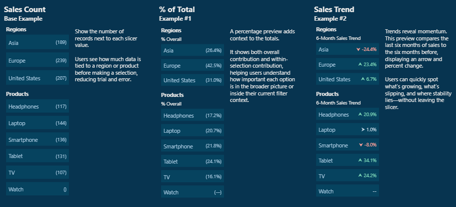

# From Static Slicers to Interactive Decision Aids

What if your slicers could answer questions before you even select them? With a little preview context, they can guide users toward the right decisions instantly.

This example demonstrates how to move beyond static slicers and transform them into **decision aids** by incorporating insights. Instead of waiting for visuals to refresh, users can view counts, percentages, or trends directly in the slicer before clicking.

  

⚡ **Quick Links**  
- 📖 Read the Full blog post: [Design Meets Data: From Static Slicers to Interactive Decision Aids](https://ethanguyant.com/2025/09/16/design-meets-data-from-static-slicers-to-interactive-decision-aids/)  
- 📊 Explore the sample report: [View on Power BI Service](https://app.powerbi.com/view?r=eyJrIjoiZTg4ZmY0ZmEtNDdlZi00NGZiLTg4ZDEtNjg1YjM1OTliYjhlIiwidCI6IjYxMGRmYjc2LTFjNjQtNDE3Yy1iODVjLTVjZDU3YTNjNDVjYyIsImMiOjJ9)
- 📁 Sample file: [`dynamic-slicers-data-previews.pbix`](./pbix/dynamic-slicers-data-previews.pbix)

---

## 📁 Sample File

[`dynamic-slicers-data-previews.pbix`](dynamic-slicers/PBIX/dynamic-slicers-data-previews.pbix)

The file includes the following examples:

* **Sales Count** - display record counts next to each slicer option
* **% of Total** - show contributions overall or within the current selection
* **Sales Trend** - reveal sales trends comparing the last 6 months to the 6 months prior
